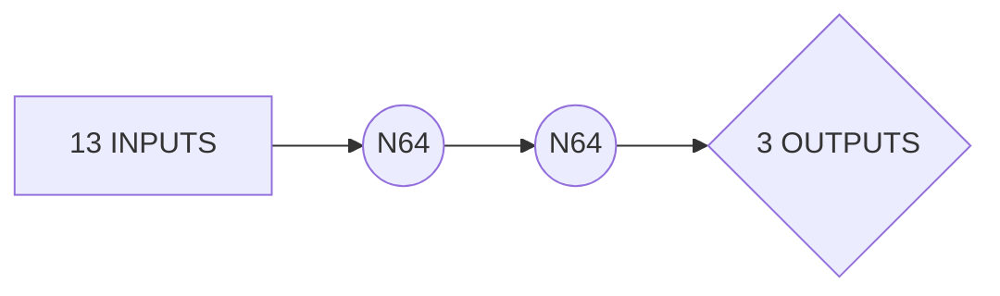

# WELCOME
BuildTools is Me I just didn't update the Author info of my git in Viusal Code.
# Library’s Needed

 - torch #For the network
 - librosa #A library for all things audio data analysis
 - numpy #for the tensors and arrays etc
 - tkinter # GUI
 - matplotlib #Graph's
 - libs.txt is a pip freeze of my libs

## Directories

 - AudioFiles/KICK #Audio files for kicks  
 - AudioFiles/HAT #Audio files for hats  
 - AudioFiles/SNARE #Audio files for snares      
 - .conda # conda libs of course.

## _Train_Model.py -

This reads from the AudioFiles/* then takes 13 features (MFFC) from each audio file, the directory is how the class is identified. Create’s a model 13 inputs 2 x 64 hidden layer 3 outputs KICK HAT SNARE. (This is to predict the class of the selected wav file). Trains the model, and dumps it as a dict, .pth. (This helps if you don’t want to train the model yourself) (it takes less than a minute) (highly depends on how big I make my dataset).

## _Classit.py -

This is a simple gui, that takes the model dict and uses the trained model to predict the class of the sample. (with a higher dataset this gets quite good at predicting). Uses GUI and adds a graph for extra clarification.

## SIMPLE LAYOUT

